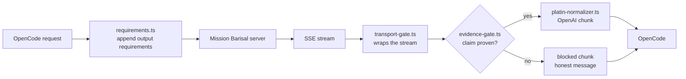

# zen-bridge

An OpenCode plugin that sits between OpenCode and the **Mission Barisal**
multi-agent server. It normalizes provider responses into the OpenAI chunk
shape OpenCode expects, blocks claims that carry no proof, and appends Mission
Barisal's output requirements to every request.

The four logic modules are dependency-free pure functions. The only package the
plugin imports is OpenCode's own `@opencode/plugin` host API, and only from the
entry point.

```bash
git clone https://github.com/sahonsrabon-os/zen-plugins.git
cd zen-plugins
./setup.sh
```

That is the whole install. The script asks which server URL the plugin should
use, writes the configuration into your OpenCode folder, registers the plugin,
and verifies it loaded.

---

## Table of contents

- [What it does](#what-it-does)
- [Requirements](#requirements)
- [Quick start](#quick-start)
- [Choosing the server URL](#choosing-the-server-url)
- [What setup.sh writes](#what-setupsh-writes)
- [setup.sh flags](#setupsh-flags)
- [Manual installation](#manual-installation)
- [Configuration reference](#configuration-reference)
- [Verifying the install](#verifying-the-install)
- [Changing the server URL later](#changing-the-server-url-later)
- [Running the tests](#running-the-tests)
- [How it works](#how-it-works)
- [Project layout](#project-layout)
- [Security notes](#security-notes)
- [Troubleshooting](#troubleshooting)
- [Uninstalling](#uninstalling)
- [License](#license)

---

## What it does

| # | Stage | Module | Purpose |
|---|-------|--------|---------|
| 1 | Request | `requirements.ts` | Appends Mission Barisal's output requirements to the prompt so every agent answers the same way. |
| 2 | Response | `platin-normalizer.ts` | Converts provider SSE payloads into authentic `chat.completion.chunk` objects. Unknown payloads pass through untouched. |
| 3 | Response | `evidence-gate.ts` | Blocks a substantive claim that carries no verifiable proof and replaces it with an honest message. |
| 4 | Response | `transport-gate.ts` | Applies the gate to the raw SSE stream, so a blocked answer is caught whether the server sends JSON or plain text. |

Because those four logic modules have no I/O, no shared state, and no side
effects, the whole gate can be unit-tested with no server running.

---

## Requirements

| Requirement | Minimum | Notes |
|-------------|---------|-------|
| Node.js | 22.6 | Type stripping is needed to run `bridge.test.ts` directly. Node 24 is recommended. |
| OpenCode | 2.x | The plugin uses the `Plugin.define` API. |
| Mission Barisal server | 3.x | Any OpenAI-compatible endpoint works; agent names assume Mission Barisal. |
| python3 | 3.8 | Used by `setup.sh` to merge JSON safely. |
| curl | — | Optional. Used to probe the server before writing the config. |

`setup.sh` runs on Linux, macOS, and Windows (Git Bash, MSYS, or Cygwin).

---

## Quick start

```bash
# 1. Get the source
git clone https://github.com/sahonsrabon-os/zen-plugins.git
cd zen-plugins

# 2. Run the installer (it will ask for your server URL)
./setup.sh

# 3. Confirm the test suite passes
node bridge.test.ts
```

Then restart OpenCode so it reloads the configuration.

### Non-interactive install

Useful for provisioning a machine without a terminal prompt:

```bash
./setup.sh --url http://localhost:5000/v1 --no-open
```

### Windows (PowerShell)

```powershell
git clone https://github.com/sahonsrabon-os/zen-plugins.git
Set-Location zen-plugins
bash ./setup.sh
```

`setup.sh` is a bash script; run it through Git Bash rather than PowerShell or
`cmd` directly.

---

## Choosing the server URL

The installer asks one question:

```text
Which Mission Barisal server URL should the plugin use?
  It must be the OpenAI-compatible base URL (ends in /v1).
  Press Enter to accept the default.
Base URL [http://localhost:5000/v1]:
```

Give it the **OpenAI-compatible base URL**. The plugin uses this URL for every
model request, so the value must end in `/v1`.

| You enter | Becomes | MCP endpoint |
|-----------|---------|--------------|
| `http://localhost:5000` | `http://localhost:5000/v1` | `http://localhost:5000/mcp` |
| `http://localhost:5000/v1` | unchanged | `http://localhost:5000/mcp` |
| `https://barisal.example.com/api/` | `https://barisal.example.com/api/v1` | `https://barisal.example.com/api/mcp` |

Trailing slashes are stripped, and `/v1` is appended when it is missing. The
MCP endpoint is derived by replacing the trailing `/v1` with `/mcp`, so you only
ever provide one URL.

You can also answer without a prompt:

```bash
MISSIONBARISAL_URL=https://barisal.example.com/v1 ./setup.sh
```

Before writing anything the installer probes `GET <url>/models`:

```text
[ ok ]  server reachable: GET http://localhost:5000/v1/models -> 200
```

If the server is down the probe prints a warning and setup continues, because a
server started later must not break the install:

```text
[warn]  server not reachable right now (GET .../models timed out). Setup continues; start it later.
```

---

## What setup.sh writes

The configuration lives in a single folder and a single file:

```text
~/.opencode/                      <-- config folder (created if missing)
└── opencode.json                 <-- the configuration file
```

Override the folder with `--dir` or the `OPENCODE_CONFIG_DIR` environment
variable.

| Item | Action | Notes |
|------|--------|-------|
| `$schema` | set if missing | `https://opencode.ai/config.json` |
| `plugins` | append | Absolute path to this checkout; never duplicated. |
| `providers.missionbarisal` | create | OpenAI-compatible provider. |
| `providers.missionbarisal.settings.baseURL` | set | Your URL. This is the value you provide each run. |
| `providers.missionbarisal.models` | add missing | 10 models. Existing entries are never deleted. |
| `model` | set if missing | Defaults to `missionbarisal/code-guru`. |
| `agent.<name>` | add missing | 9 agents, all `mode: all`. An agent you already customized keeps its prompt and permissions. |
| `mcp.missionbarisal-mcp` | create or update | URL derived from your base URL. |

A timestamped backup of the previous file is written before every change:

```text
opencode.json.bak-20261003-061108
```

The write is atomic: the new content goes to `opencode.json.tmp` first, then
replaces the original. An interrupted run cannot leave a half-written config.

If the file already holds everything, nothing is rewritten:

```text
[ done ] config already up to date - no changes needed
```

---

## setup.sh flags

| Flag | Effect |
|------|--------|
| `--url URL` | Use this server URL instead of prompting. |
| `--dir PATH` | Write the config to `PATH/opencode.json` instead of `~/.opencode/`. |
| `--dry-run` | Print every change and write nothing. |
| `--no-open` | Do not open the config folder when finished. |
| `--yes`, `-y` | Skip the prompt and accept the default URL. |
| `--help`, `-h` | Show usage. |

Examples:

```bash
# Show what would change on this machine, touching nothing
./setup.sh --url https://barisal.example.com/v1 --dry-run

# Install into an isolated config folder
./setup.sh --url http://localhost:5000/v1 --dir /tmp/oc-test

# Accept the default URL without being asked
./setup.sh --yes --no-open
```

---

## Manual installation

Do this if you would rather edit the file yourself.

**1. Create the folder and file**

```bash
mkdir -p ~/.opencode
touch ~/.opencode/opencode.json
```

**2. Install the plugin dependency**

```bash
cd zen-plugins
npm install
```

**3. Add the configuration**

Paste the block from [Configuration reference](#configuration-reference) below
into `~/.opencode/opencode.json`.

**4. Register the plugin**

The `plugins` array entry must be an absolute path to this checkout. A relative
path is resolved against OpenCode's working directory, not against the config
file, which is why the installer always writes an absolute path.

---

## Configuration reference

```json
{
  "$schema": "https://opencode.ai/config.json",
  "model": "missionbarisal/code-guru",
  "plugins": [
    "/absolute/path/to/zen-plugins"
  ],
  "providers": {
    "missionbarisal": {
      "name": "Mission Barisal Local Server",
      "package": "@opencode/ai/providers/openai-compatible",
      "settings": {
        "baseURL": "http://localhost:5000/v1"
      },
      "models": {
        "mission": { "name": "Mission Barisal Orchestrator" },
        "code-guru": { "name": "Code Guru (Monu)" },
        "bug-hunter": { "name": "Bug Hunter (Jewel)" },
        "security-hero": { "name": "Security Hero (Bablu)" },
        "perf-wizard": { "name": "Performance Wizard (Rashed)" },
        "doc-king": { "name": "Documentation King (Halim)" },
        "qa-tyrant": { "name": "Quality Tyrant (Mojnu)" },
        "team-heart": { "name": "Team Heart (Jara)" },
        "customer-experience-specialist": { "name": "Customer Experience Specialist" },
        "ecommerce-operations-analyst": { "name": "E-Commerce Operations Analyst" }
      }
    }
  },
  "mcp": {
    "missionbarisal-mcp": {
      "type": "remote",
      "url": "http://localhost:5000/mcp",
      "oauth": false,
      "codemode": true
    }
  },
  "agent": {
    "code-guru": {
      "description": "System Architecture, Design Patterns, Code Structure",
      "mode": "all",
      "model": "missionbarisal/code-guru",
      "prompt": "You are Code Guru (Monu). Focus on system architecture, design patterns, and code structure.",
      "permission": { "edit": "allow", "bash": "allow" }
    },
    "bug-hunter": {
      "description": "Bug Detection, Debugging, Error Handling, Logic Validation",
      "mode": "all",
      "model": "missionbarisal/bug-hunter",
      "prompt": "You are Bug Hunter (Jewel). Focus on bug detection, debugging, error handling, and logic validation.",
      "permission": { "edit": "allow", "bash": "allow" }
    }
  }
}
```

The example shows two agents for readability. `setup.sh` writes all nine, each
bound to its own model.

---

## Verifying the install

**1. Check the plugin loaded**

```bash
opencode plugin list
```

```text
ID          VERSION  SOURCE
zen-bridge  local    /absolute/path/to/zen-plugins/index.ts
```

**2. Check the server answers**

```bash
curl -s http://localhost:5000/v1/models | head -c 200
```

**3. Watch the plugin log**

The plugin writes one line per gated response to the OpenCode log:

```text
[zen-bridge] bridge active for provider "missionbarisal"
[zen-bridge] evidence gate (json): BLOCKED (no proof provided)
```

**4. Run the test suite**

```bash
node bridge.test.ts
```

```text
ℹ tests 13
ℹ pass 13
ℹ fail 0
```

---

## Changing the server URL later

Re-run the installer with the new URL. It updates the base URL and the derived
MCP endpoint in place and backs up the old file first:

```bash
./setup.sh --url https://new-host.example.com/v1
```

```text
[change] baseURL: http://localhost:5000/v1 -> https://new-host.example.com/v1
[change] MCP 'missionbarisal-mcp' url -> https://new-host.example.com/mcp
[backup] /home/you/.opencode/opencode.json.bak-20261003-061108
[ wrote] /home/you/.opencode/opencode.json
```

Add `--dry-run` first if you want to see the changes before committing to them.
Re-running with the same URL is a no-op.

---

## Running the tests

```bash
cd zen-plugins
node bridge.test.ts
```

The suite is dependency-free and uses Node's built-in test runner. It covers the
evidence gate, the SSE transport gate, the chunk normalizer, and blocked-chunk
reconstruction:

```text
✔ gate passes a claim with file:line evidence
✔ gate passes honest confession of no proof
✔ gate passes short/trivial chatter
✔ gate blocks Bengali claim without evidence
✔ gate passes Bengali honest confession
✔ normalizer maps flat text payload to OpenAI chunk
✔ normalizer preserves standard chunks
✔ blocked chunk keeps structure and carries truth message
✔ transport: proven SSE passes through unchanged in order
✔ transport: unproven claim is replaced with honest message
✔ transport: non-JSON data and raw lines pass through
✔ transport: stream without [DONE] still finalizes gate
...
ℹ pass 13
ℹ fail 0
```

---

## How it works



### The evidence gate

The gate reads a response and decides whether it may be shown as-is.

| Response | Verdict | Why |
|----------|---------|-----|
| Claim with `file.ts:12` or test output | PASS | Verifiable proof is present. |
| "I have no proof" style confession | PASS | Honest admission of uncertainty, not a claim. |
| Trivial chatter under 40 characters | PASS | Not a substantive claim. |
| Explanation that asserts no new fact | PASS | Nothing to prove. |
| Substantive claim with no proof | BLOCK | Replaced with an honest message. |

The default minimum length is 40 characters, exported as
`DEFAULT_MIN_LENGTH`. Pass `extraPatterns` through `EvidenceGateOptions` to add
project-specific proof markers.

**Known limitation.** Any backtick-delimited span satisfies the built-in proof
pattern, so a model can pass the gate by emitting `` `something` `` instead of a
real `file.ts:12` reference. Unit and transport-level blocking are proven, but a
determined model can still slip a backtick pseudo-proof through a live session.
Tightening this to file/line and test-output patterns only is a deliberate,
backward-compatible change if you want a stricter gate.

---

## Project layout

```text
zen-plugins/
├── README.md               this document
├── setup.sh                installer
├── LICENSE                 MIT
├── .gitignore
├── package.json
├── package-lock.json
├── index.ts                plugin entry: hooks + wiring
├── evidence-gate.ts        claim / proof / confession verdicts
├── transport-gate.ts       SSE stream wrapper
├── platin-normalizer.ts    provider payload -> OpenAI chunk
├── requirements.ts         output requirement text
└── bridge.test.ts          13 tests, Node built-in runner
```

| File | Lines | Responsibility |
|------|-------|----------------|
| `index.ts` | 118 | Plugin definition, `context` and `http.response` hooks |
| `evidence-gate.ts` | 166 | Evidence, claim, and confession patterns |
| `transport-gate.ts` | 249 | Incremental SSE parsing and gating |
| `platin-normalizer.ts` | 127 | Chunk normalization and blocked-chunk rebuild |
| `requirements.ts` | 19 | Requirement text appended to prompts |
| `bridge.test.ts` | 140 | Test suite |

---

## Security notes

Facts verified against the source, not assumed:

- The plugin makes **no network calls of its own**. It has no `fetch`, no HTTP
  client, and no outbound socket. All traffic to the Mission Barisal server
  flows through OpenCode's own provider driver.
- It reads **no environment variables and no config files**. The only imports
  are `@opencode/plugin` and its four sibling modules.
- It **writes nothing**: no disk writes, no shell execution, no file edits. Its
  sole side effect is one `console.log` line per gated response.
- It filters on `providerID === "missionbarisal"`, so responses from other
  providers are never inspected or rewritten.
- No credentials are stored in this repository. Nothing here needs a token,
  because nothing here authenticates to anything.
- The config folder may contain a `*.bak-*` file after an install. Those
  backups hold your server URL and model names; treat them like the config
  file itself.
- The evidence gate is a quality control, not a security boundary. It reduces
  unproven claims in output; it does not validate untrusted input.

---

## Troubleshooting

**`[error] .../opencode.json is not valid JSON`**
The existing file has a syntax error. `setup.sh` stops rather than overwriting
it. Fix the JSON, or move the file aside and run again to regenerate.

**`python3 is required`**
Install it with `apt install python3`, `dnf install python3`, or
`brew install python3`.

**`npm not found - skip 'npm install'`**
The plugin dependency `@opencode/plugin` will be missing and the plugin will
not load. Install Node.js, then run `npm install` in this folder.

**`zen-bridge not listed by 'opencode plugin list'`, or it says `No plugins found`**
Three causes, in the order to check them:

1. **Cold start.** The OpenCode background service answers empty or with a
   premature `No plugins found` while it is warming up. This is a false
   negative, not a real failure. Wait a second and run the command again.
   `setup.sh` already retries three times for this reason.
2. **Missing path.** The `plugins` array does not contain this checkout's
   absolute path. Run `./setup.sh` again, or add the path by hand.
3. **Custom `--dir`.** `plugin list` always reads OpenCode's own config
   (`~/.opencode/opencode.json`). If you installed with `--dir` pointing
   elsewhere, it is reading a different file than the one you just wrote, so
   the two will not agree. `setup.sh` prints a note when this happens.

**Server reachable but no models appear**
Confirm the URL ends in `/v1` and that `GET <url>/models` returns HTTP 200.
Re-run with `--dry-run` to see the exact value the config will hold.

**Changes do not take effect**
OpenCode reads `opencode.json` at startup. Restart it after every edit.

---

## Uninstalling

Remove this block from `~/.opencode/opencode.json`:

```json
"plugins": [ "/absolute/path/to/zen-plugins" ]
```

Then delete the checkout:

```bash
rm -rf zen-plugins
```

Remove `providers.missionbarisal`, `mcp.missionbarisal-mcp`, and the nine
agents from `opencode.json` as well if you no longer use Mission Barisal.

---

## License

MIT. See [LICENSE](LICENSE).
