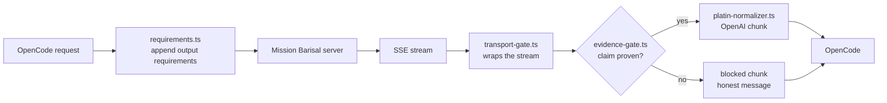

# zen-bridge

An OpenCode plugin that sits between OpenCode and the **Mission Barisal**
multi-agent server. It normalizes provider responses into the OpenAI chunk
shape OpenCode expects, blocks claims that carry no proof, and appends Mission
Barisal's output requirements to every request.

The four logic modules are dependency-free pure functions. The only package the
plugin imports is OpenCode's own `@opencode/plugin` host API, and only from the
entry point.

```bash
git clone https://github.com/sahonsrabon-os/zen-plugins.git
cd zen-plugins
./setup.sh
```

That is the whole install. The script asks which server URL the plugin should
use, writes the configuration into your OpenCode folder, registers the plugin,
and verifies it loaded.

---

## Table of contents

- [What it does](#what-it-does)
- [Requirements](#requirements)
- [Quick start](#quick-start)
- [Choosing the server URL](#choosing-the-server-url)
- [What setup.sh writes](#what-setupsh-writes)
- [setup.sh flags](#setupsh-flags)
- [Manual installation](#manual-installation)
- [Configuration reference](#configuration-reference)
- [Verifying the install](#verifying-the-install)
- [Changing the server URL later](#changing-the-server-url-later)
- [Running the tests](#running-the-tests)
- [How it works](#how-it-works)
- [Project layout](#project-layout)
- [Security notes](#security-notes)
- [Troubleshooting](#troubleshooting)
- [Uninstalling](#uninstalling)
- [License](#license)

---

## What it does

| # | Stage | Module | Purpose |
|---|-------|--------|---------|
| 1 | Request | `src/requirements.ts` | Appends Mission Barisal's output requirements to the prompt so every agent answers the same way. |
| 2 | Response | `src/platin-normalizer.ts` | Converts provider SSE payloads into authentic `chat.completion.chunk` objects. Unknown payloads pass through untouched. |
| 3 | Response | `src/evidence-gate.ts` | Blocks a substantive claim that carries no verifiable proof and replaces it with an honest message. |
| 4 | Response | `src/transport-gate.ts` | Applies the gate to the raw SSE stream, so a blocked answer is caught whether the server sends JSON or plain text. |
| 5 | Startup | `src/runtime-log.ts` | When the server boots, creates the runtime directory, appends a boot line, and probes the server with a read-only GET so the log records whether it answered. |

Rows 1–4 have no I/O, no shared state and no side effects, so the whole gate
can be unit-tested with no server running. Row 5 is the only module that
touches the disk or the network; its suite runs against a temporary directory
and a local HTTP server it owns, never against your real home directory or
the real Mission Barisal server.

---

## Requirements

| Requirement | Minimum | Notes |
|-------------|---------|-------|
| Node.js | 22.6 | Type stripping is needed to run `test/bridge.test.ts` directly. Node 24 is recommended. |
| OpenCode | 2.x | The plugin uses the `Plugin.define` API. |
| Mission Barisal server | 3.x | Any OpenAI-compatible endpoint works; agent names assume Mission Barisal. |
| python3 | 3.8 | Used by `setup.sh` to merge JSON safely. |
| curl | — | Optional. Used to probe the server before writing the config. |

`setup.sh` runs on Linux, macOS, and Windows (Git Bash, MSYS, or Cygwin).

---

## Quick start

```bash
# 1. Get the source
git clone https://github.com/sahonsrabon-os/zen-plugins.git
cd zen-plugins

# 2. Run the installer (it will ask for your server URL)
./setup.sh

# 3. Confirm the test suite passes
node test/bridge.test.ts
```

Then restart OpenCode so it reloads the configuration.

### Non-interactive install

Useful for provisioning a machine without a terminal prompt:

```bash
./setup.sh --url http://localhost:5000/v1 --no-open
```

### Windows (PowerShell)

```powershell
git clone https://github.com/sahonsrabon-os/zen-plugins.git
Set-Location zen-plugins
bash ./setup.sh
```

`setup.sh` is a bash script; run it through Git Bash rather than PowerShell or
`cmd` directly.

---

## Choosing the server URL

The installer asks one question:

```text
Which Mission Barisal server URL should the plugin use?
  It must be the OpenAI-compatible base URL (ends in /v1).
  Press Enter to accept the default.
Base URL [http://localhost:5000/v1]:
```

Give it the **OpenAI-compatible base URL**. The plugin uses this URL for every
model request, so the value must end in `/v1`.

| You enter | Becomes | MCP endpoint |
|-----------|---------|--------------|
| `http://localhost:5000` | `http://localhost:5000/v1` | `http://localhost:5000/mcp` |
| `http://localhost:5000/v1` | unchanged | `http://localhost:5000/mcp` |
| `https://barisal.example.com/api/` | `https://barisal.example.com/api/v1` | `https://barisal.example.com/api/mcp` |

Trailing slashes are stripped, and `/v1` is appended when it is missing. The
MCP endpoint is derived by replacing the trailing `/v1` with `/mcp`, so you only
ever provide one URL.

You can also answer without a prompt:

```bash
MISSIONBARISAL_URL=https://barisal.example.com/v1 ./setup.sh
```

Before writing anything the installer probes `GET <url>/models`:

```text
[ ok ]  server reachable: GET http://localhost:5000/v1/models -> 200
```

If the server is down the probe prints a warning and setup continues, because a
server started later must not break the install:

```text
[warn]  server not reachable right now (GET .../models timed out). Setup continues; start it later.
```

---

## What setup.sh writes

The configuration lives in a single folder and a single file:

```text
~/.opencode/                      <-- config folder (created if missing)
└── opencode.json                 <-- the configuration file
```

Override the folder with `--dir` or the `OPENCODE_CONFIG_DIR` environment
variable.

| Item | Action | Notes |
|------|--------|-------|
| `$schema` | set if missing | `https://opencode.ai/config.json` |
| `plugins` | append | Absolute path to this checkout; never duplicated. |
| `providers.missionbarisal` | create | OpenAI-compatible provider. |
| `providers.missionbarisal.settings.baseURL` | set | Your URL. This is the value you provide each run. |
| `providers.missionbarisal.models` | add missing | 10 models. Existing entries are never deleted. |
| `model` | set if missing | Defaults to `missionbarisal/code-guru`. |
| `agent.<name>` | add missing | 9 agents, all `mode: all`. An agent you already customized keeps its prompt and permissions. |
| `mcp.missionbarisal-mcp` | create or update | URL derived from your base URL. |

A timestamped backup of the previous file is written before every change:

```text
opencode.json.bak-20261003-061108
```

The write is atomic: the new content goes to `opencode.json.tmp` first, then
replaces the original. An interrupted run cannot leave a half-written config.

If the file already holds everything, nothing is rewritten:

```text
[ done ] config already up to date - no changes needed
```

---

## setup.sh flags

| Flag | Effect |
|------|--------|
| `--url URL` | Use this server URL instead of prompting. |
| `--dir PATH` | Write the config to `PATH/opencode.json` instead of `~/.opencode/`. |
| `--dry-run` | Print every change and write nothing. |
| `--no-open` | Do not open the config folder when finished. |
| `--yes`, `-y` | Skip the prompt and accept the default URL. |
| `--help`, `-h` | Show usage. |

Examples:

```bash
# Show what would change on this machine, touching nothing
./setup.sh --url https://barisal.example.com/v1 --dry-run

# Install into an isolated config folder
./setup.sh --url http://localhost:5000/v1 --dir /tmp/oc-test

# Accept the default URL without being asked
./setup.sh --yes --no-open
```

---

## Manual installation

Do this if you would rather edit the file yourself.

**1. Create the folder and file**

```bash
mkdir -p ~/.opencode
touch ~/.opencode/opencode.json
```

**2. Install the plugin dependency**

```bash
cd zen-plugins
npm install
```

**3. Add the configuration**

Paste the block from [Configuration reference](#configuration-reference) below
into `~/.opencode/opencode.json`.

**4. Register the plugin**

The `plugins` array entry must be an absolute path to this checkout. A relative
path is resolved against OpenCode's working directory, not against the config
file, which is why the installer always writes an absolute path.

---

## Configuration reference

```json
{
  "$schema": "https://opencode.ai/config.json",
  "model": "missionbarisal/code-guru",
  "plugins": [
    "/absolute/path/to/zen-plugins"
  ],
  "providers": {
    "missionbarisal": {
      "name": "Mission Barisal Local Server",
      "package": "@opencode/ai/providers/openai-compatible",
      "settings": {
        "baseURL": "http://localhost:5000/v1"
      },
      "models": {
        "mission": { "name": "Mission Barisal Orchestrator" },
        "code-guru": { "name": "Code Guru (Monu)" },
        "bug-hunter": { "name": "Bug Hunter (Jewel)" },
        "security-hero": { "name": "Security Hero (Bablu)" },
        "perf-wizard": { "name": "Performance Wizard (Rashed)" },
        "doc-king": { "name": "Documentation King (Halim)" },
        "qa-tyrant": { "name": "Quality Tyrant (Mojnu)" },
        "team-heart": { "name": "Team Heart (Jara)" },
        "customer-experience-specialist": { "name": "Customer Experience Specialist" },
        "ecommerce-operations-analyst": { "name": "E-Commerce Operations Analyst" }
      }
    }
  },
  "mcp": {
    "missionbarisal-mcp": {
      "type": "remote",
      "url": "http://localhost:5000/mcp",
      "oauth": false,
      "codemode": true
    }
  },
  "agent": {
    "code-guru": {
      "description": "System Architecture, Design Patterns, Code Structure",
      "mode": "all",
      "model": "missionbarisal/code-guru",
      "prompt": "You are Code Guru (Monu). Focus on system architecture, design patterns, and code structure.",
      "permission": { "edit": "allow", "bash": "allow" }
    },
    "bug-hunter": {
      "description": "Bug Detection, Debugging, Error Handling, Logic Validation",
      "mode": "all",
      "model": "missionbarisal/bug-hunter",
      "prompt": "You are Bug Hunter (Jewel). Focus on bug detection, debugging, error handling, and logic validation.",
      "permission": { "edit": "allow", "bash": "allow" }
    }
  }
}
```

The example shows two agents for readability. `setup.sh` writes all nine, each
bound to its own model.

---

## Verifying the install

**1. Check the plugin loaded**

```bash
opencode plugin list
```

```text
ID          VERSION  SOURCE
zen-bridge  local    /absolute/path/to/zen-plugins/index.ts
```

**2. Check the server answers**

```bash
curl -s http://localhost:5000/v1/models | head -c 200
```

**3. Watch the plugin log**

The plugin writes one line per gated response to the OpenCode log:

```text
[zen-bridge] bridge active for provider "missionbarisal"
[zen-bridge] evidence gate (json): BLOCKED (no proof provided)
```

**4. Run the test suite**

```bash
node test/bridge.test.ts
```

```text
ℹ tests 13
ℹ pass 13
ℹ fail 0
```

---

## Changing the server URL later

Re-run the installer with the new URL. It updates the base URL and the derived
MCP endpoint in place and backs up the old file first:

```bash
./setup.sh --url https://new-host.example.com/v1
```

```text
[change] baseURL: http://localhost:5000/v1 -> https://new-host.example.com/v1
[change] MCP 'missionbarisal-mcp' url -> https://new-host.example.com/mcp
[backup] /home/you/.opencode/opencode.json.bak-20261003-061108
[ wrote] /home/you/.opencode/opencode.json
```

Add `--dry-run` first if you want to see the changes before committing to them.
Re-running with the same URL is a no-op.

---

## Runtime log

Every time the OpenCode server starts it loads this plugin, and the plugin
records that boot:

```text
~/.opencode/
├── opencode.json            written by setup.sh; the plugin only reads it
└── zen-bridge-runtime.log   appended by the plugin at startup
```

The directory is created automatically if it is missing. The log is
append-only, one line per boot plus one for the connection check:

```text
2026-10-03T09:14:22.118Z boot provider=missionbarisal
2026-10-03T09:14:22.171Z connection OK http://localhost:5000/v1/models status=200 6ms
```

If the config holds no `baseURL` the probe is skipped and the reason is
logged instead. If the server refuses the connection the line reads
`connection FAILED` together with the error text. Either way the bridge
still starts: the probe is diagnostic, never a gate on startup.

Watch it live with:

```bash
tail -f ~/.opencode/zen-bridge-runtime.log
```

The file records timestamps, the provider id, the probed URL, its HTTP
status and its latency. It holds no tokens and no request or response
bodies, and it lives outside this repository.

---

## Running the tests

```bash
cd zen-plugins

node test/bridge.test.ts         # gate, normalizer, transport
node test/runtime-log.test.ts    # boot log, config read, connection probe
node test/bengali-gate.probe.ts  # coverage report, not pass/fail
```

All three are dependency-free and use Node's built-in test runner. The first
two suites fail the run on any broken assertion; the probe is a report that
prints one row per case and ends with a mismatch count, which is how coverage
gaps are found rather than hidden.

Verified result:

```text
===== bridge.test.ts =====
ℹ tests 13
ℹ pass 13
ℹ fail 0

===== runtime-log.test.ts =====
ℹ tests 9
ℹ pass 9
ℹ fail 0

===== bengali-gate.probe.ts =====
total 33, expectation mismatches: 0
```

55 checks in total, 0 failures.

### What the probe covers

`test/bengali-gate.probe.ts` runs 33 Bengali and English cases through the
gate and asserts the verdict each one should get:

- **A1–A16** — which claim phrases are recognised, including the language
  parity rule: English `installed` / `renamed` / `wrote` / `deleted` are
  blocked, so their Bengali equivalents must be blocked too.
- **B1–B7** — invisible characters placed strictly inside the span the
  pattern must match: ZWJ, ZWNJ, non-breaking space, double space, NFD, NFC.
- **C1–C3** — an honest confession must override a claim, including when the
  confession itself carries a ZWJ or a non-breaking space.
- **D1–D7** — backtick pseudo-proof: a bare span such as `` `something` `` is
  no longer evidence, while a file reference, `file:line`, line range or test
  output inside backticks still is.

The probe's expectations are stated as a principle, not fitted to the code:
a claim is a claim regardless of the characters used to write it, and a
confession is a confession regardless of them as well.

---

## How it works



### The evidence gate

The gate reads a response and decides whether it may be shown as-is.

| Response | Verdict | Why |
|----------|---------|-----|
| Claim with `file.ts:12` or test output | PASS | Verifiable proof is present. |
| "I have no proof" style confession | PASS | Honest admission of uncertainty, not a claim. |
| Trivial chatter under 40 characters | PASS | Not a substantive claim. |
| Explanation that asserts no new fact | PASS | Nothing to prove. |
| Substantive claim with no proof | BLOCK | Replaced with an honest message. |

The default minimum length is 40 characters, exported as
`DEFAULT_MIN_LENGTH`. Pass `extraPatterns` through `EvidenceGateOptions` to add
project-specific proof markers.

### Match-time normalisation

Bengali text routinely carries characters that mean nothing yet defeat a
literal pattern match. Before matching, the gate works on a **copy** of the
response with the following folded away:

| Folded | Unicode | Why it appears |
|--------|---------|----------------|
| Zero-width joiner, zero-width non-joiner | U+200D, U+200C | inserted between consonants and before i-matras |
| Zero-width space, directional marks, BOM | U+200B–U+200F, U+2060, U+FEFF | editor and paste artefacts |
| Non-breaking space | U+00A0 | pasted and typeset text |
| Runs of whitespace | — | double space, tab, newline |

The original string is never rewritten. Normalisation applies only to the
copy used for matching, so what the user is shown is untouched.

This matters in both directions. Without it, a claim written with a ZWJ was
passed as `PASS`, while an honest confession written with a ZWJ was
`BLOCKED` — the worst possible inversion, where honesty is punished and an
unproven claim is rewarded. Normalising the whole input rather than
patching individual patterns fixes every pattern at once.

### Language parity

English claim verbs and their Bengali equivalents are held at the same
coverage. `installed`, `renamed`, `wrote`, `deleted`, `refactored`,
`implemented`, `configured`, `enabled` and the rest are claims, and so are
`install korechi`, `rename korechi`, `likhechi`, `muliye felechi`,
`refactor korechi`, `implement korechi`, `configar korechi` and `chalu
korechi`. Language must not decide whether an unproven claim is blocked.

The Bengali patterns are generated from the words themselves rather than
transcribed by hand, and every one is exercised by
`test/bengali-gate.probe.ts`.

**Backtick pseudo-proof — fixed.** The built-in backtick pattern used to
accept any delimited span, so a model could pass the gate by emitting
`` `something` `` instead of a real `file.ts:12` reference. It now satisfies
the gate only when the span itself carries a checkable reference: a file with
an extension (`` `handler.ts` ``, `` `src/app.ts:42` ``) or test output
(`` `424 pass` ``). A bare symbol such as `` `buildFinalMessages` `` is
decoration, not evidence, and is blocked like any other unproven claim.
Cases D1–D7 in `test/bengali-gate.probe.ts` hold this in place.

What remains true is the honest limit of any pattern-based gate: it checks
the shapes it knows about, and a response that cites a real-looking
`file.ts:12` it never opened is not detectable from the text alone.

---

## Project layout

```text
zen-plugins/
├── README.md               this document
├── setup.sh                installer
├── LICENSE                 MIT
├── .gitignore
├── package.json
├── package-lock.json
├── index.ts                plugin entry: hooks + wiring
├── src/
│   ├── evidence-gate.ts        claim / proof / confession verdicts
│   ├── transport-gate.ts       SSE stream wrapper
│   ├── platin-normalizer.ts    provider payload -> OpenAI chunk
│   ├── requirements.ts         output requirement text
│   └── runtime-log.ts          boot log, config read, connection probe
└── test/
    ├── bridge.test.ts          13 tests: gate, normalizer, transport
    ├── runtime-log.test.ts     9 tests: logging, config, probing
    └── bengali-gate.probe.ts   33-case coverage probe, prints a report
```

`index.ts` stays at the repository root because that is the path OpenCode
resolves from the `plugins` array; everything else lives under `src/` or
`test/`.

| File | Lines | Responsibility |
|------|-------|----------------|
| `index.ts` | 138 | Plugin definition, `context` and `http.response` hooks, runtime bootstrap |
| `src/evidence-gate.ts` | 245 | Evidence, claim, and confession patterns, plus match-time normalisation |
| `src/transport-gate.ts` | 249 | Incremental SSE parsing and gating |
| `src/platin-normalizer.ts` | 127 | Chunk normalization and blocked-chunk rebuild |
| `src/requirements.ts` | 19 | Requirement text appended to prompts |
| `src/runtime-log.ts` | 121 | Boot log, config read, read-only connection probe |
| `test/bridge.test.ts` | 140 | 13 tests |
| `test/runtime-log.test.ts` | 174 | 9 tests |
| `test/bengali-gate.probe.ts` | 109 | 33-case coverage probe |

---

## Security notes

Facts verified against the source, not assumed:

- It makes **exactly one network call of its own**: a read-only
  `GET <baseURL>/models` issued once during plugin setup, solely so the boot
  log records whether the Mission Barisal server is reachable. Nothing is
  ever POSTed, and no write method is used against the server. Every other
  byte of traffic flows through OpenCode's own provider driver. The probe
  carries a 5-second timeout, so an unreachable server cannot delay startup.
- It reads **one config file, read-only**: `~/.opencode/opencode.json`, and
  only the `providers.missionbarisal.settings.baseURL` value. It reads **no
  environment variables** and never modifies or rewrites the config.
- It **writes one file**: it appends a timestamped line to
  `~/.opencode/zen-bridge-runtime.log`, creating `~/.opencode/` first if that
  directory is missing. There is no shell execution, no file edit, and no
  config write. Logging failures are swallowed and return `null` rather than
  being thrown, so an unwritable disk degrades the feature instead of
  breaking the bridge.
- The boot log holds timestamps, the provider id, the probed URL, its status
  and its latency. It holds **no tokens and no request or response bodies**.
  It lives outside this repository, so it is not committed by accident.
- It filters on `providerID === "missionbarisal"`, so responses from other
  providers are never inspected or rewritten.
- No credentials are stored in this repository. Nothing here needs a token,
  because nothing here authenticates to anything.
- The config folder may contain a `*.bak-*` file after an install. Those
  backups hold your server URL and model names; treat them like the config
  file itself.
- The evidence gate is a quality control, not a security boundary. It reduces
  unproven claims in output; it does not validate untrusted input.

---

## Troubleshooting

**`[error] .../opencode.json is not valid JSON`**
The existing file has a syntax error. `setup.sh` stops rather than overwriting
it. Fix the JSON, or move the file aside and run again to regenerate.

**`python3 is required`**
Install it with `apt install python3`, `dnf install python3`, or
`brew install python3`.

**`npm not found - skip 'npm install'`**
The plugin dependency `@opencode/plugin` will be missing and the plugin will
not load. Install Node.js, then run `npm install` in this folder.

**`zen-bridge not listed by 'opencode plugin list'`, or it says `No plugins found`**
Three causes, in the order to check them:

1. **Cold start.** The OpenCode background service answers empty or with a
   premature `No plugins found` while it is warming up. This is a false
   negative, not a real failure. Wait a second and run the command again.
   `setup.sh` already retries three times for this reason.
2. **Missing path.** The `plugins` array does not contain this checkout's
   absolute path. Run `./setup.sh` again, or add the path by hand.
3. **Custom `--dir`.** `plugin list` always reads OpenCode's own config
   (`~/.opencode/opencode.json`). If you installed with `--dir` pointing
   elsewhere, it is reading a different file than the one you just wrote, so
   the two will not agree. `setup.sh` prints a note when this happens.

**Server reachable but no models appear**
Confirm the URL ends in `/v1` and that `GET <url>/models` returns HTTP 200.
Re-run with `--dry-run` to see the exact value the config will hold.

**Changes do not take effect**
OpenCode reads `opencode.json` at startup. Restart it after every edit.

---

## Uninstalling

Remove this block from `~/.opencode/opencode.json`:

```json
"plugins": [ "/absolute/path/to/zen-plugins" ]
```

Then delete the checkout:

```bash
rm -rf zen-plugins
```

Remove `providers.missionbarisal`, `mcp.missionbarisal-mcp`, and the nine
agents from `opencode.json` as well if you no longer use Mission Barisal.

---

## License

MIT. See [LICENSE](LICENSE).
